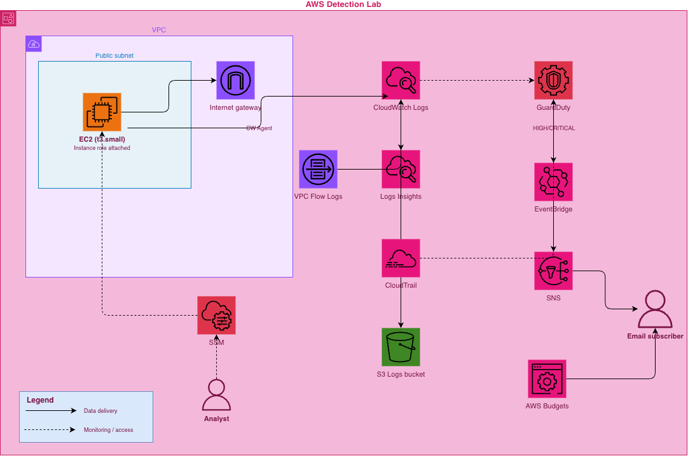

# AWS Detection Lab

A cheap, modular AWS detection engineering lab. Deploy in ~2 minutes.


## Structure

```
├── versions.tf                  # Provider version constraints
├── main.tf                      # Calls all modules, wires outputs → inputs
├── variables.tf                 # All settings with descriptions and validation
├── outputs.tf                   # Useful info printed after deploy
├── terraform.tfvars             # Your local config — gitignored
└── modules/
    ├── storage/                 # S3 bucket for CloudTrail logs
    ├── networking/              # VPC, subnet, IGW, security group, VPC Flow Logs
    ├── cloudtrail/              # Trail, CloudWatch log group, metric filters
    ├── guardduty/               # Detector, optional email alerts
    └── ec2/                     # Linux VM, IAM instance profile, CloudWatch Agent, Auditd
```

## Architecture



## What gets deployed

| Component | Purpose |
|---|---|
| **CloudTrail** | Every management-plane API call in your account, queryable in CloudWatch Insights |
| **VPC Flow Logs** | Network traffic metadata, queryable in CloudWatch Insights |
| **GuardDuty** | ML-based threat detection across CloudTrail, DNS, and Flow Logs |
| **CloudWatch Agent** | Ships host logs from the VM to CloudWatch |
| **CloudWatch Insights** | Query interface across all log groups in one place |
| **Auditd** | Linux kernel audit framework — process execution, file access, network connections |
| **EC2 t3.small** | Amazon Linux VM with a realistic IAM instance profile for attack simulation |
| **SSM Session Manager** | Browser and CLI access to the VM — no open ports required |
| **EventBridge** | Routes HIGH/CRITICAL GuardDuty findings to SNS |
| **SNS** | Delivers email alerts for HIGH/CRITICAL GuardDuty findings |
| **S3** | Stores CloudTrail logs with versioning enabled |
| **AWS Budgets** | Monthly spend alert at 80% and 100% of your configured limit |

### Log groups created

```
/detection-lab/cloudtrail/          → AWS API calls (CloudTrail)
/detection-lab/vpc-flow-logs/       → Network traffic (VPC Flow Logs)
/detection-lab/host/auditd/         → Process execution, syscalls (Auditd)
/detection-lab/host/syslog/         → System events
/detection-lab/host/auth/           → SSH, sudo, login events
```

## Prerequisites

### Terraform

Install Terraform >= 1.6 from [developer.hashicorp.com/terraform/install](https://developer.hashicorp.com/terraform/install).

**macOS (Homebrew)**
```bash
brew tap hashicorp/tap
brew install hashicorp/tap/terraform
terraform -version
```

**Windows (Chocolatey)**
```powershell
choco install terraform
terraform -version
```

**Windows (winget)**
```powershell
winget install Hashicorp.Terraform
terraform -version
```

### AWS CLI

Install from [docs.aws.amazon.com/cli](https://docs.aws.amazon.com/cli/latest/userguide/getting-started-install.html).

**macOS (Homebrew)**
```bash
brew install awscli
```

**Windows (Chocolatey)**
```powershell
choco install awscli
```

**Windows (winget)**
```powershell
winget install Amazon.AWSCLI
```

Then configure it with your credentials:

```bash
aws configure
# AWS Access Key ID: <your key>
# AWS Secret Access Key: <your secret>
# Default region name: us-east-1
# Default output format: json
```

### IAM Permissions

Attach the `AdministratorAccess` managed policy to your AWS IAM user. This is the simplest setup for a personal lab and avoids permission errors during deployment.

If you have multiple policies or inline policies attached, remove them — inline policies with explicit `Deny` statements override `AdministratorAccess` and cause hard-to-debug errors.

```bash
# Verify what's attached to your user
aws iam list-attached-user-policies --user-name <your-user> --output table
aws iam list-user-policies --user-name <your-user> --output table
```

## Deploy

```bash
git clone https://github.com/<your-org>/aws-detection-lab.git
cd aws-detection-lab
cp terraform.tfvars.example terraform.tfvars
# optionally edit terraform.tfvars
terraform init
terraform apply
```

## Connect to the VM

```bash
# Printed after apply, or:
aws ssm start-session --target <instance-id> --region us-east-1
```

No SSH key required. SSM Session Manager is the primary access method. SSH port 22 is open but restricted to `allowed_ip` as a fallback.

## Simulate attacks (from the VM)

Stratus Red Team is pre-installed. Connect via SSM then run:

```bash
stratus list                    # see all available TTPs
stratus detonate <ttp-name>     # run a TTP
stratus cleanup --all           # clean up after
```

## Query the logs

All logs land in CloudWatch Insights — one place to query everything:

```
https://<region>.console.aws.amazon.com/cloudwatch/home#logsV2:logs-insights
```

Select a log group and run a query. See the docs folder for query guides:

- [`docs/cloudwatch-cloudtrail.md`](docs/cloudwatch-cloudtrail.md) — CloudTrail query guide
- [`docs/vpc-flow-logs.md`](docs/vpc-flow-logs.md) — VPC Flow Logs query guide

## Check GuardDuty findings

GuardDuty findings appear in the GuardDuty console ~15 minutes after a TTP is detonated:

```
https://<region>.console.aws.amazon.com/guardduty/
```

## Stop the VM when not in use

```bash
aws ec2 stop-instances --instance-ids <id> --region us-east-1
aws ec2 start-instances --instance-ids <id> --region us-east-1
```

The VM also shuts itself down nightly via a cron job at the configured UTC hour.

## Tear down

```bash
terraform destroy
```
> [!IMPORTANT]
> The S3 bucket is automatically emptied and deleted on `terraform destroy` (`force_destroy = true`).
> If you want to preserve logs, set `force_destroy = false` in `modules/storage/main.tf` before destroying.

## Configuration (`terraform.tfvars`)

| Variable | Default | Description |
|---|---|---|
| `alert_email` | required | Email for GuardDuty HIGH/CRITICAL findings and budget alerts |
| `project_name` | `detection-lab` | Prefix for all resource names |
| `region` | `us-east-1` | AWS region |
| `budget_limit` | `50` | Monthly spend limit in USD — alerts at 80% and 100% |
| `auto_shutdown_hour` | `23` | UTC hour the VM shuts itself down daily (0-23) |
| `log_retention_days` | `30` | CloudWatch log retention in days |

## Cost

| Component | Cost |
|---|---|
| CloudTrail | Free |
| CloudWatch Logs | ~$1–2/month |
| GuardDuty (after 30-day trial) | ~$5–10/month |
| t3.small with auto-shutdown | ~$3/month |
| **Total** | **~$9–15/month** |
